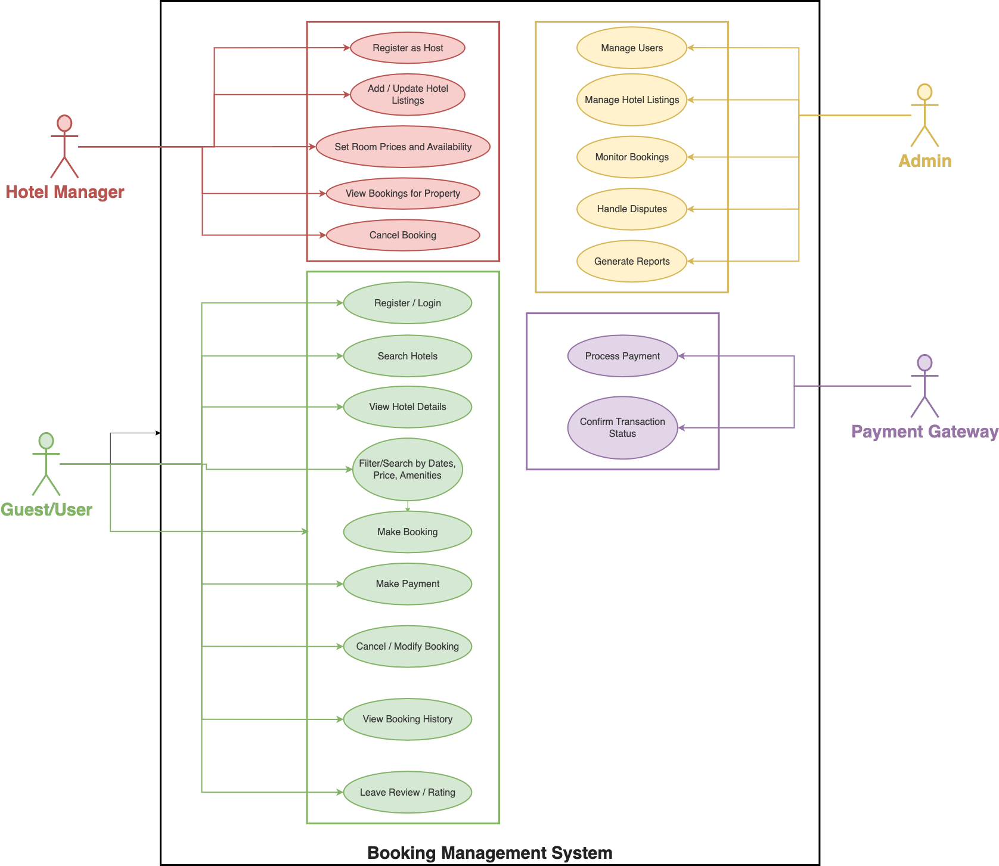

# Requirement Analysis in Software Development.
This repository contains the Requirement Analysis Project for a Booking Management System, developed as part of a school assignment. The goal is to simulate a real-world software development scenario by clearly documenting, analyzing, and organizing system requirements. It serves as a structured yet accessible reference point for understanding the foundational phase of software development, with a focus on clarity, precision, and practical application.

## What is Requirement Analysis?
Requirement analysis is the process of identifying, analyzing, and documenting what a software system needs to do and the conditions under which it must operate. It acts as the foundation for the entire development cycle by translating stakeholder needs into clear, actionable requirements. This phase ensures that everyone involved has a shared understanding of the system’s goals, helps prevent costly errors later in development, and guides the design, testing, and implementation processes. Ultimately, good requirement analysis leads to better planning, smoother execution, and a product that truly meets user expectations.

## Why is Requirement Analysis Important?
* **Prevents Miscommunication and Misalignment:** 
Requirement analysis ensures that all stakeholders—clients, developers, designers, and testers—have a shared understanding of what the software should do. By clearly documenting expectations early, it reduces the risk of miscommunication, conflicting goals, or incorrect assumptions throughout the project.

* **Reduces Costly Rework:**
Identifying and resolving requirement issues early in the SDLC is far less expensive than fixing them during or after development. A thorough analysis helps catch missing, ambiguous, or conflicting requirements upfront, preventing wasted time, effort, and resources later in the project.

* **Provides A Solid Foundation for Design and Testing:**
Accurate and detailed requirements serve as a blueprint for designing the system architecture and writing test cases. They help ensure that the final product aligns with user needs and that every feature is tested against clear, predefined expectations.

## Key Activities in Requirement Analysis.
1. **Requirement Gathering**
    * This is the initial step where all potential sources of requirements are identified.
    * It involves collecting raw information from stakeholders such as clients, users, business analysts, or system experts.
    * The goal is to understand the general expectations and needs for the system.
2. **Requirement Elicitation**
    * Goes deeper than simple gathering—this is where you actively draw out the real needs behind the stakeholders' requests.
    * Techniques used include interviews, workshops, questionnaires, observations, and studying existing systems.
    * Elicitation helps uncover hidden, conflicting, or unstated requirements that might affect the project.
3. **Requirement Documentation**
    * The requirements gathered and elicited are organized into clear, structured formats.
    * Documentation may include Software Requirement Specifications (SRS), use cases, user stories, or functional requirement documents.
    * This step ensures that all requirements are traceable, understandable, and referenceable throughout the project.
4. **Requirement Analysis and Modeling**
    * In this phase, the documented requirements are analyzed for completeness, consistency, feasibility, and clarity.
    *   It may involve creating models such as data flow diagrams (DFDs), UML diagrams, or wireframes to visually represent the system.
    * The aim is to structure the requirements logically and identify relationships between different components.
5. **Requirement Validation**
    * This step ensures that the documented and analyzed requirements truly reflect what stakeholders need.
    * It involves reviewing the requirements with stakeholders to confirm accuracy and gain approval.
    * Validation helps catch misunderstandings or errors before moving into design and development, reducing the risk of failure.

## Types of Requirements

### Functional Requirements
These specify what the system must do—the visible features and actions it supports:

* **User Authentication & Profile Management:**

    Users must be able to register, log in, manage profiles, and view booking history.

* **Hotel Listing & Search:**

    Users can browse hotels by location, check‑in/check‑out dates, and filter by room type, price, amenities, etc.

* **Booking & Reservation Flow:**

    Users select available rooms, complete bookings (creating reservations), and receive confirmations. Admins can also cancel reservations when needed.

* **Room & Pricing Management by Admins:**

    Hotel owners or administrators must be able to register hotels, add or update room types and inventory, and define daily pricing.

* **Payment Processing:**

    The system processes payments using secure methods (credit/debit cards, UPI, PayPal, etc.) and issues receipts or confirmations.

* **Reviews, Ratings & Messaging (optional enhancement)**

    Users can leave feedback and message hosts or administrators directly through the system.

### Non-Functional Requirements
These describe how the system should perform, focusing on performance, reliability, and user experience:

* **High Availability & Reliability**

    The system must be operational nearly 24/7, especially during peak booking times, with minimal downtime .

* **Low Latency for Search & Reservation**

    Search responses must be fast (e.g. under ~500 ms), ensuring a smooth user experience even under load.

* **Scalability & Concurrency Handling**

    The system must support many users and bookings simultaneously across distributed locations. It must also prevent double booking via concurrency control mechanisms.

* **Data Consistency & Integrity**

    Booking and inventory data must remain consistent—no two users should be able to book the same room at the same time.

* **Security & Data Protection**

    Secure authentication, encrypted data storage, and compliance with payment and privacy standards (e.g. PCI-DSS, GDPR) are essential.

* **Fault Tolerance & Resilience**

    The system should gracefully handle failures (e.g. network, service crashes) and recover without data loss or user disruption 

* **Global Accessibility & Localization**

    The system should support users from various regions, with localized formats like currency, time‑zones, and languages where applicable.

## Use Case Diagrams
Use Case Diagrams are a type of Unified Modeling Language (UML) diagram used to visually represent the interactions between users (called "actors") and a system. They show what the system does (its use cases), who interacts with it, and how those interactions happen at a high level.

A use case diagram includes:

* **Actors:** The people or systems that interact with the software (e.g., "Customer", "Admin").

* **Use Cases:** The functions or services the system provides (e.g., "Book Room", "Cancel Reservation").

* **System Boundary:** A box that defines what is inside the system and what’s external to it.

* **Relationships:** Arrows or connectors that show how actors interact with use cases.

### Benefits of Use Case Diagrams
* **Clear Visual Overview:** They provide a simple, intuitive way to understand the major functionalities of the system at a glance.

* **Improves Communication:** Use case diagrams help bridge the gap between technical teams and non-technical stakeholders by showing how users will interact with the system without technical jargon.

* **Helps Identify Requirements:** They assist in identifying all the system’s functional requirements by focusing on what the user needs the system to do.

* **Supports System Design:** Use case diagrams serve as a foundation for further modeling and design, helping developers structure the system architecture around user interactions.

* **Encourages User-Centered Thinking:** Because the focus is on how users interact with the system, it promotes designing with user experience in mind.

### A Use Case Diagram

## Acceptance Criteria.
Acceptance criteria are essential in requirement analysis because they define the specific conditions a feature must meet to be considered complete and acceptable. They help clarify expectations, guide development and testing, prevent scope creep, and ensure objective evaluation of work. By setting clear standards from the start, acceptance criteria improve communication between stakeholders and development teams, leading to more accurate and successful project outcomes.

Here’s an example of Acceptance Criteria for a Checkout feature in a Booking Management System:

**Acceptance Criteria (Feature: Checkout)**
1. User must be logged in to complete a booking checkout.

2. Selected room(s) and dates must be available at the time of checkout.

3. Total cost (including taxes and fees) must be clearly displayed before payment.

4. User must provide valid guest details (name, contact, etc.) before proceeding.

5. User must choose a payment method (e.g., credit card, PayPal, etc.).

6. Upon successful payment:

    * A confirmation message is displayed.

    * A booking reference number is generated.

    * A confirmation email is sent to the user with booking details.

7. If payment fails:

    * The system displays an error message with a retry option.

    * No booking is created or saved in the system.

8. Checkout must complete within 60 seconds of user confirmation to avoid timeouts or session expiration.

